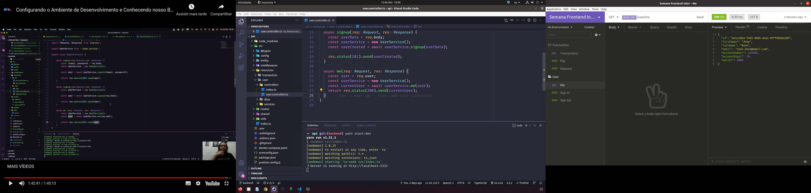

> # API Semana Frontend Banco Inter

[Translate to 🇺🇸](/Readme.md)

A API simula o funcionamento do PIX. Através de uma carteira onde o usuário poderá realizar transações PIX.

 

> ## Fluxo Principal da API

- O usuário poderá inserir um valor e gerar uma chave.

- Com essa chave gerada poderá enviar para um outro usuário.

- O usário que recebeu a chave poderá usá-la para efetuar um pagamento na conta do usuário dono da chave.

 

> ## Endpoints

> ### Usuário

- user/me: Retorna dados do usuário autenticado
- user/signin: Realiza o login do usuário
- user/signup: Realiza o cadastro de um novo usuário

> ### Transação

- pix/transactions: Retorna as transações do usuário autenticado
- pix/request: Gera uma chave PIX
- pix/pay/{key}: Realiza um pagamento

 

> ## Tecnologias

- [Crypto-js](https://www.npmjs.com/package/crypto-js)
- [Express](https://expressjs.com/pt-br/)
- [Express-Async-Errors](https://www.npmjs.com/package/express-async-errors)
- [Js-Base64](https://www.npmjs.com/package/js-base64)
- [JsonWebToken](https://www.npmjs.com/package/jsonwebtoken)
- [Postgres](https://www.npmjs.com/package/postgres)
- [Postgres Client](https://www.npmjs.com/package/pg)
- [TypeORM](https://typeorm.io/#/)
- [Typescript](https://www.typescriptlang.org/)

 

> ## Licença

Projetado com 🧡 por [Alexandre Menezes](https://www.linkedin.com/in/alexandresmenezes). Licenciado sob a [Licença MIT](./License.md).
