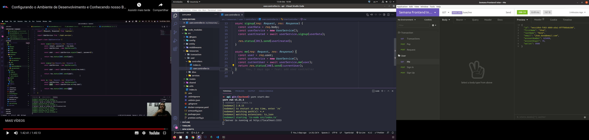

> # API Week Frontend Inter Bank

[Translate to 🇧🇷](.github/Readme-pt-BR.md)

The API simulates how the PIX works. Through a wallet where the user can carry out PIX transaction.

 

> ## API Main Flow

- The user will be able to enter a value and generate a key.

- With this generated key you can send it to another user.

- The user who received the key will be able to use it to make a payment to the account of the user who owns the key.

 

> ## Endpoints

> ### User

- user/me: Returns autenticated user data
- user/signin: Log in the user
- user/signup: Register a new user

> ### Transaction

- pix/transactions: Returns authenticated user transactions
- pix/request: Generate a PIX key
- pix/pay/{key}: Make a payment

 

> ## Technologies

- [Crypto-js](https://www.npmjs.com/package/crypto-js)
- [Express](https://expressjs.com/pt-br/)
- [Express-Async-Errors](https://www.npmjs.com/package/express-async-errors)
- [Js-Base64](https://www.npmjs.com/package/js-base64)
- [JsonWebToken](https://www.npmjs.com/package/jsonwebtoken)
- [Postgres](https://www.npmjs.com/package/postgres)
- [Postgres Client](https://www.npmjs.com/package/pg)
- [TypeORM](https://typeorm.io/#/)
- [Typescript](https://www.typescriptlang.org/)

 

> ## License

Designed with 🧡 by [Alexandre Menezes](https://www.linkedin.com/in/alexandresmenezes). License under the [MIT License](./License.md).
