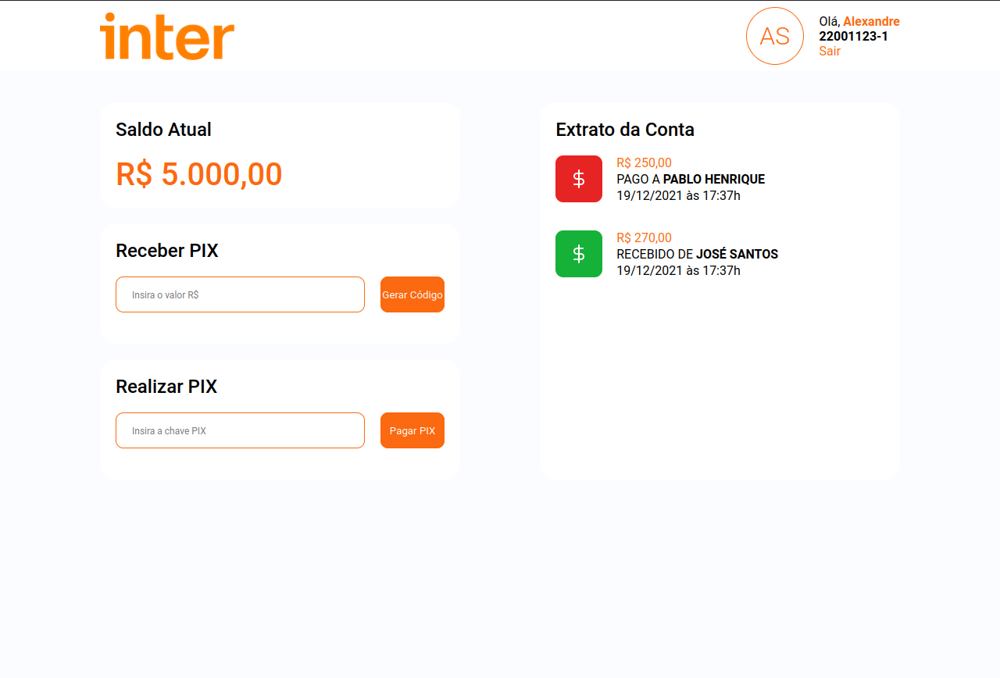
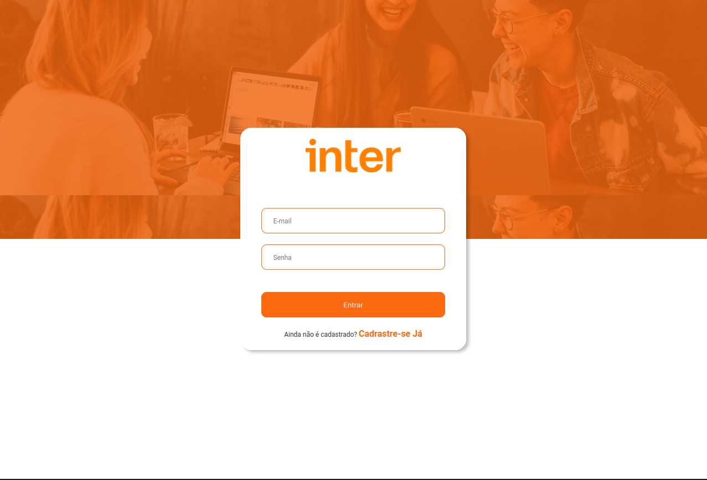
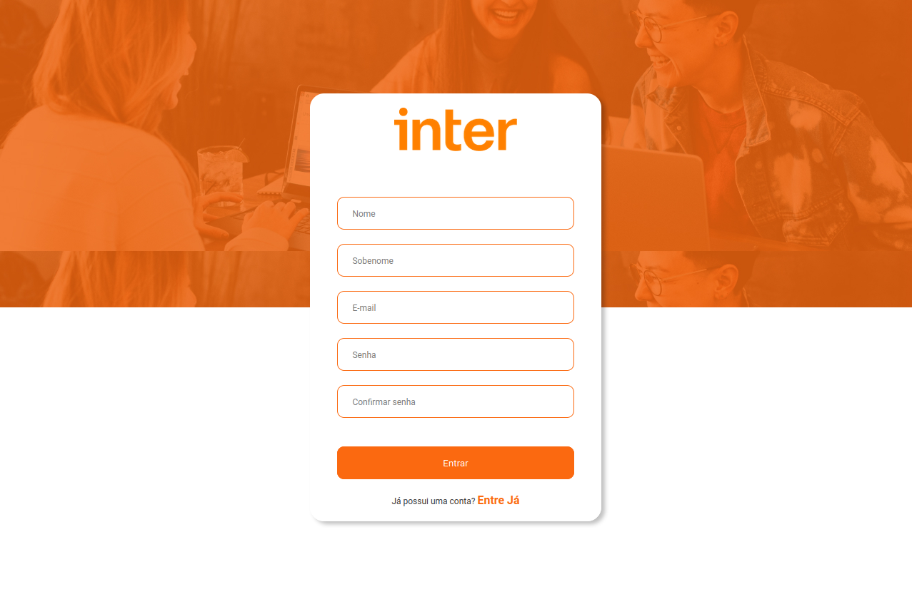

> # APP Semana Frontend Banco Inter

[Translate to 🇺🇸](/Readme.md)

O APP simula o funcionamento do PIX. Através de uma carteira onde o usuário poderá realizar transações PIX.

 

> ## Fluxo Principal do APP

- O usuário poderá inserir um valor e gerar uma chave.

- Com essa chave gerada poderá enviar para um outro usuário.

- O usário que recebeu a chave poderá usá-la para efetuar um pagamento na conta do usuário dono da chave.

 

> ## Páginas

> signin: Página de login do usuário

 
 

> signup: Página de cadastro de um novo usuário

 
 

> dashboard: Página principal

 
 

> ## Tecnologias

- [Date-fns](https://date-fns.org/)
- [React](https://pt-br.reactjs.org)
- [React Icons](https://react-icons.github.io/react-icons)
- [React Router DOM](https://www.npmjs.com/package/react-router-dom)
- [Styled Components](https://styled-components.com)
- [Typescript](https://www.typescriptlang.org/)

 

> ## Licença

Projetado com 🧡 por [Alexandre Menezes](https://www.linkedin.com/in/alexandresmenezes). Licenciado sob a [Licença MIT](./License.md).
